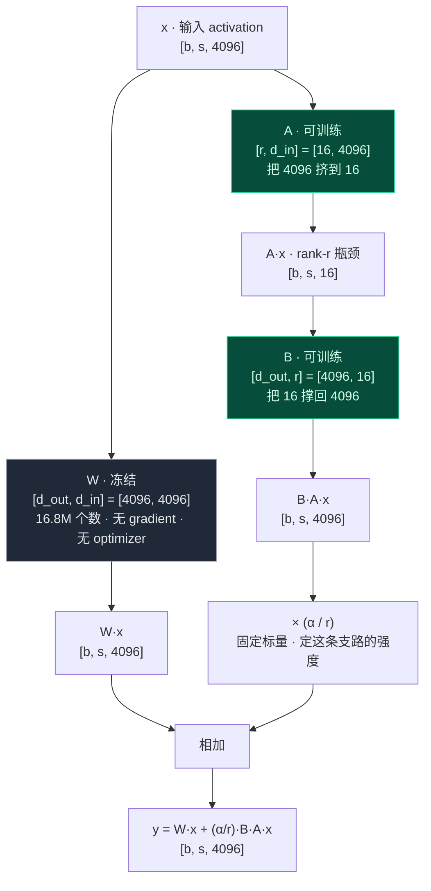
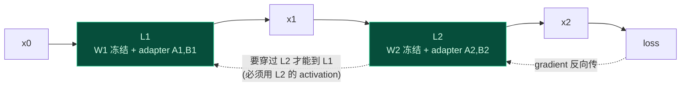
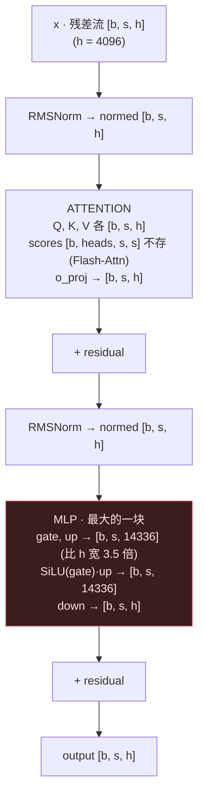

<!--
  LANGUAGE EXCEPTION (intentional): this file is written in 中文 at the user's
  explicit request ("这也例外用中文"). The repo convention (CLAUDE.md directives 3 & 5)
  is English for in-repo docs; this is a deliberate, authorized exception for a
  personal study reference. Do NOT "fix" it back to English. ML / systems terms
  stay in English as usual (weight, gradient, hidden, token, LoRA, activation, ...).
  Diagrams use Mermaid so they render on GitHub / in a Markdown viewer.
-->

# LoRA 架构 与 activation 内存(自用参考)

这份是把一次对话里讲清楚的几件事固定下来,方便以后回看:

1. LoRA 到底长什么样(架构图)
2. 为什么 LoRA **几乎不省 activation**
3. activation 内存怎么算,那个 `×14` 从哪来(`atten + mlp` 的 `×7` 图示)
4. 为什么 activation 能直接乘层数 `×L`

全文以 Llama-3.1-8B 的真实数字为例:`hidden h = 4096`、`MLP 中间 = 14336`、`层数 L = 32`;LoRA 用 `r = 16`。

---

## 1. LoRA 架构

对**一个** weight 矩阵 `W` 做 LoRA,前向变成:

```
y = W·x  +  (α / r) · B · (A · x)
    └ 冻结 ┘      └── 可训练的 adapter ──┘
```



### 每个维度是什么

- `W = [d_out, d_in] = [4096, 4096]`。**注意 `q_proj` 碰巧是方阵,只因为 `d_out == d_in`**;一般情况下 `W` 是 `[d_out, d_in]`,不是方的。
- `x = [b, s, d_in] = [b, s, 4096]`:这一层的输入 activation。`b` = batch(一次几句),`s` = seq_len(每句几个 token),`d_in` = 4096(每个 token 多少个数)。
- `A = [r, d_in] = [16, 4096]`:把 4096 **挤**到 `r = 16`。
- `B = [d_out, r] = [4096, 16]`:把 16 **撑**回 4096。
- `A·x = [b, s, 16]`:rank-r 瓶颈,极小。低秩就藏在这个 16 里。
- `α / r`:一个**固定标量**,设定 LoRA 这条支路相对 base 的强度。它是结构性的(会一直留到 inference),不是 learning rate(那个只在训练时存在)。

### 参数量对比(这才是 LoRA 省内存的地方)

```
W   : 4096 × 4096            = 16,777,216  ≈ 16.8M   ← 冻结,不训练
A+B : 16×4096 + 4096×16      =    131,072  ≈ 131K    ← 只训这部分
                                              131K / 16.8M ≈ 0.8%
```

那套 `×12` 的训练开销(weight 2 + gradient 2 + Adam m 4 + v 4)**只落在这 131K 上**;`W` 不参与训练,只占 2 个 byte/参数(没有 gradient、没有 optimizer state)。

> 一句话:LoRA 把 `W` 冻住、只训两个瘦矩阵 `A`、`B`;**省的是 weight 的 gradient 和 optimizer state(也就是 `×12` 那个地板),不是 activation。** 下面解释为什么 activation 省不掉。

---

## 2. 为什么 LoRA 几乎不省 activation

直觉上会觉得:既然只训 `A`、`B`,那只存 `A`、`B` 的 activation 不就行了?冻结的部分等于只做推理,推理不存 activation——为什么也要存?

**这个直觉对了一半。** activation 是为**两件事**付钱的,直觉只想到了第一件:

| 作用 | 需要存什么 | LoRA 能不能省 |
|---|---|---|
| 1. 算**某个可训练参数**自己的 gradient | 那个运算的输入 `x` | 不能。`dL/dA = (Bᵀ·dL/dy)·xᵀ`,adapter `A` 算自己的 gradient 时,还是要这一层完整的输入 `x = [b,s,4096]` |
| 2. 让 gradient **穿过一层、往前传**给更早的可训练参数 | 这一层的 activation(非线性的中间值) | 不能。和这层 weight 冻没冻**无关** |

### 关键:冻结的 base 不是在做独立推理

LoRA 的 adapter 是**插在每一层**的(第 1 层到第 32 层都有 `A`、`B`)。要更新第 1 层的 adapter,gradient 必须从 loss 一路传回第 1 层,**中间要穿过后面所有的冻结层**。而 gradient 每穿过一层的非线性(softmax / SiLU / layernorm),backward 就必须用到那一层存下来的 activation——哪怕那层的 `W` 是冻的。



链式法则看一眼(W 全冻,只训 adapter):

```
要更新 A1:  dL/dA1 = dL/dx1 · (dx1/dA1)
其中        dL/dx1 = 把 gradient 穿过 L2 传回来 = 需要 L2 的 activation
```

`W2` 虽然冻了,但 `L2` 的 activation 还是得留着,否则 gradient 传不回 `L1` 的 `A1`。**冻结只省掉了「算 W2 自己的 gradient」,没省掉「让 gradient 路过 L2」。**

而「推理不存 activation」是因为推理**根本没有 loss、没有反向**,下游没有任何东西要这些中间值,算完就扔。LoRA 训练时不一样:下游有 adapter 等着收 gradient,这条反向的路必须铺着 activation。

### QLoRA 也一样

QLoRA 把冻结的 base 压成 4-bit(NF4)存着,但**前向时每块要解压回 bf16** 才能算 `W·x`,算出来的 activation 还是 bf16、全尺寸。所以 QLoRA 省的是 base 的**存储**(0.5 byte/参数),activation 一分没省。

> 结论:**full / LoRA / QLoRA 三者的 activation 基本一样**,都得在 `×12 / ×2 / ×0.6` 这个地板之外,另加 activation。这也是为什么 70B 用 QLoRA、地板只要 42 GB,真要在一张卡上跑还**必须开 gradient checkpointing**——否则那个全尺寸的 activation 会把预算撑爆。checkpointing 是另一个独立的开关,不是 LoRA 自带的。

---

## 3. activation 内存怎么算 —— `×14` 从哪来

### 完整公式

```
训练显存 ≈ 参数 × 12 bytes              ← 地板(weight 2 + grad 2 + Adam m 4 + v 4)
        + L · b · s · h × 14 bytes      ← activation,不开 checkpointing
        + 几百 MB 框架开销

开 checkpointing:  把那个 14 降到 2(只存层边界,backward 时重算其余)
```

- `参数 × 12` 是**地板**,不随 batch / seq 变。
- `activation` 是**工作量项**,随 `batch`、`seq`、`hidden`、`层数` 涨,**不随参数量**涨。
- 这就是为什么同一个模型,加大 batch 会 OOM——涨的是 activation,不是地板。

### `×14` 不是「一个数 14 个 byte」

一个 bf16 数就是 2 个 byte。`×14` 的意思是:**每个 `[b,s,h]` 槽位,一层要存大约 14 个 byte 的中间值,因为一层不止存一个 `[b,s,h]`,而是存大约 7 份**(`atten + mlp`),每份 bf16 = 2 个 byte。

```
14 ≈ 7 份 [b,s,h] 大小的张量  ×  2 byte/bf16
```



一层留给 backward 的中间值,粗略按 `[b,s,h]` 单位拆:

| 来源 | 张量 | 大小(以 `[b,s,h]` 为单位) |
|---|---|---|
| 残差 | `x` | ~1 |
| attention 前的 norm | `normed` | ~1 |
| attention | `Q, K, V` | ~2 |
| MLP 前的 norm | `normed` | ~1 |
| **MLP 中间(最大)** | `SiLU(gate)·up` = `[b, s, 14336]` | ~2 |
| **合计** | | **≈ 7** |

`MLP` 那个 `[b, s, 14336]` 中间是**单块最大头**(比 `[b,s,h]` 宽 `14336/4096 = 3.5` 倍)。`scores [b, heads, s, s]` 那个随 `s²` 暴涨的注意力矩阵,因为用了 Flash-Attention **不落地**,所以不在这 7 份里——这也是现在系数是 `~14` 而不是老论文里 `~34` 的原因。

> 诚实标注:这 `~7` 份是个**有效平均值**,不是精确逐张清点。具体存几张,取决于实现(Flash-Attention、哪些重算、kernel 融合)。取 `7`(即 `14`)是因为它能反推出下面那次 1B 实测的 `1.8 GB`;换个实现,系数会在 `~10–34` 之间浮动。

### `hidden` 是什么(顺带钉死,容易和 `seq` 混)

- 模型的**输入不是向量**,是一串 `token ID`(整数);每个 token 先过 **embedding 查表**(表是 `[vocab, hidden] = [128256, 4096]`),才变成一串数。
- `hidden` 就是「每个 token 变成了多少个数」,也就是这个向量的**宽度**。
- 形状这么长出来的:一句话 → `s` 个 token → embedding → 每个 token `hidden` 个数 → 加 batch → `[b, s, hidden]`,一路 `L` 层都保持这个形状。

```
seq    = 有多少个 token       (这句话多长)
hidden = 每个 token 几个数     (每个 token 向量多宽)
```

这是**两条不同的轴**,别混。

### 拿 1B 实测验证(那个 14 不是编的)

那次 full SFT:`Llama-3.2-1B`,`L = 16`、`b = 4`、`s = 1024`、`h = 2048`。

```
activation ≈ L · b · s · h × 14
           = 16 × 4 × 1024 × 2048 × 14
           ≈ 1.88e9 bytes  ≈ 1.9 GB
```

公式预测地板 `~12 GB`,实测峰值 `13.84 GB`,差 `~1.8 GB` —— 正好对上这 `1.9 GB`。所以这套算术(地板 + 工作量项)是可信的。

### 几个模型的 activation 基准(batch = 1,单位 GB)

| 模型 | seq 1k | seq 2k | seq 4k | seq 8k |
|---|---|---|---|---|
| **1B** `h2048 L16` | 0.5 | 0.9 | 1.9 | — |
| **8B** `h4096 L32` | — | 3.8 | 7.5 | 15 |
| **70B** `h8192 L80` | — | 19 | 38 | — |

读法:batch 线性(`b=8` 就 `×8`);开 checkpointing 后,把上面的数除以约 `7`(`14 → 2`)。

---

## 4. 为什么 activation 能直接 `×L`(层结构相同)

`×L` 这步**预设了「每一层一样大」**。对**标准 dense transformer**(Llama / GPT / Mistral dense)来说,这个前提是真的,而且不是巧合,是架构逼出来的。

### residual stream 把每层宽度焊死

每一层干的事是 `x = x + sublayer(x)`。要让 `x` 和 `sublayer(x)` 能**相加**,两者形状必须完全一致,都得是 `[b, s, h]`。于是每一层的输入和输出都被锁死成 `[b, s, h]`,宽度 `h` 不能变。

所以 Llama-3.1-8B 的 32 层,**每一层** `hidden=4096`、`heads=32`、`MLP 中间=14336` 一字不差;层与层之间**只有 weight 的数值不同,形状/结构完全相同**。因此一层该存多少 activation,32 层就是它 `×32`——`×L` 是**精确**的,不是近似。「一层 neuron 多、一层少」在标准 transformer 里**不会发生**。

### 例外(这里 `×L` 就不成立,要分开算)

- **MoE(Mixture of Experts)**:有的层是 dense MLP,有的是路由到若干 expert 的 MoE 层,两种层的 activation 不同档次。
- **混合架构**:比如交替用 full attention 和 sliding-window attention,或把 attention 层和 Mamba/SSM 层穿插堆叠。

这些得「dense 层算一份、特殊层算一份,各自乘各自的层数再相加」。

### 一个小口径

`embedding` 表和最后的 `lm_head` **不是 transformer 层**(是 `[vocab, h]` 矩阵),不在 `×L` 里。但它们的 activation 很小(embedding 输出就一个 `[b,s,h]`,logits `[b,s,vocab]` 只出现一次、不乘 L),所以 `L·b·s·h×14` 覆盖的是 transformer 主体(大头),忽略掉这点可以接受。

---

## 一页纸总结

- **LoRA 架构**:`W` 冻结,`A` 把 `d_in` 挤到 `r`、`B` 把 `r` 撑回 `d_out`,只训 `A`、`B`(约 `0.8%`),`y = W·x + (α/r)·B·A·x`。
- **省的是地板,不是 activation**:冻结去掉的是 weight 的 gradient + optimizer(`×12 → ×2`);activation 因为「forward 照跑 + gradient 要穿过每层 + adapter 还要输入 x」,和 full 基本一样。
- **activation ≈ `L · b · s · h × 14`**:`14` = 一层约 `7` 份 `[b,s,h]`(`atten + mlp`,MLP 那个 `4` 倍宽的中间最大)× `2` byte/bf16;开 checkpointing 降到 `×2`。
- **能 `×L`**:residual stream 把每层宽度焊成同一个 `h`,标准 transformer 每层结构相同;MoE / 混合架构例外。
