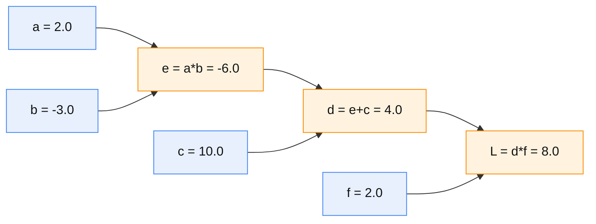
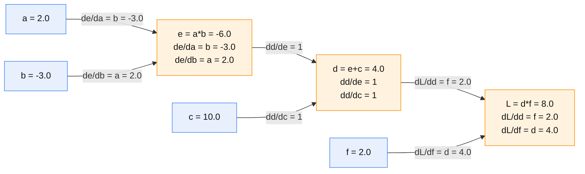
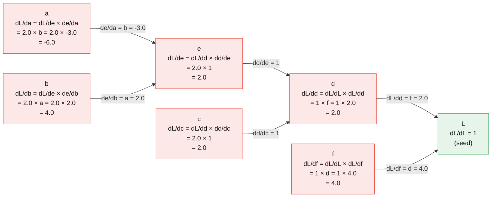
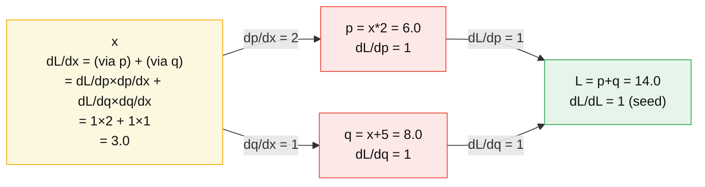
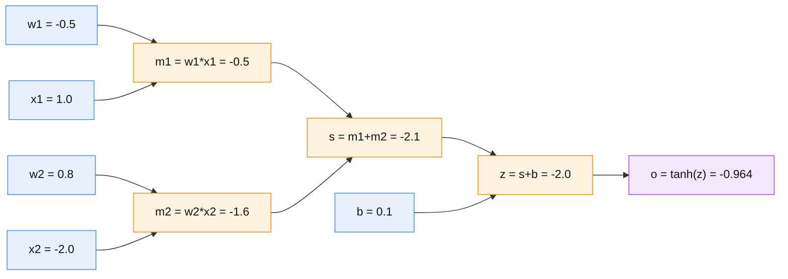
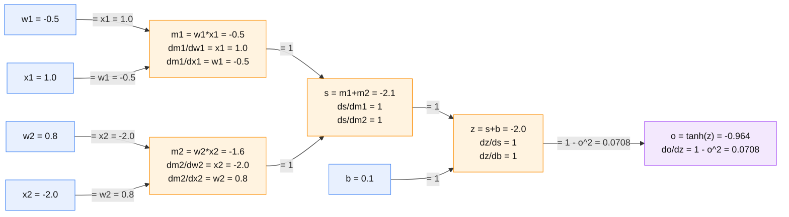
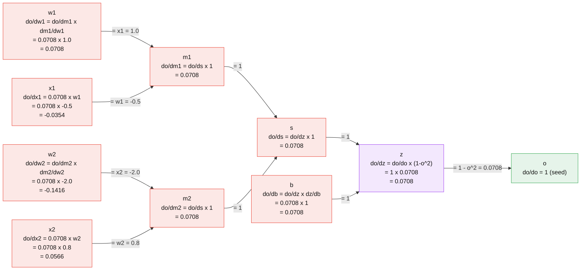

# B1 — micrograd: backprop on scalars — learning notes

Reference notes (fact-based, no Q&A). Learner is doing Track B from the start as
review / gap-fill. Everything here is scalar — micrograd has zero tensors, zero
dims (Karpathy strips tensors so the autograd skeleton is bare). This is the one
day with no shapes to track.

What B1 adds beyond Track A: Track A USED `loss.backward()` as a black box. B1 builds
that black box by hand — a ~100-line `Value` class with `__add__`, `__mul__`,
`backward()`. The gap it fills is the mechanics BETWEEN calling `.backward()` and
`.grad` being filled: the 4 steps below.

---

## Notation facts (read once, applies to everything below)

1. **`d` is the derivative OPERATOR, not a number and not division.** `de/da` is one
   indivisible symbol meaning "derivative of e w.r.t. a" = a MULTIPLIER: push a a
   little, how many times as much does e move. Never split it into `de / da`.
   (In this example a node also happens to be named `d` — pure letter clash, unrelated.)

2. **`de/da` is NOT `e/a`.** `e/a` is a static ratio; `de/da` is a rate of change.
   They coincide only for trivial forms. Proof they differ:

        e = a*b,  a=2, b=-3, e=-6:   e/a = -3.0,   de/da = b  = -3.0   (equal — coincidence)
        e = a*a,  a=2,       e=4:    e/a =  2.0,   de/da = 2a =  4.0   (DIFFERENT)

3. **One line often carries two equals signs: the RULE then the PLUGGED-IN value.**

        dL/dd = f = 2.0
              |   |
              |   +-- f's forward value (the number)
              +------ the derivative rule for multiply (still symbolic)

   Read as: "dL/dd equals f by the multiply rule; f's forward value is 2.0."

4. **Two local-derivative rules cover the whole graph** (no need to memorize each edge):

        multiply  y = u*v  ->  dy/du = v,  dy/dv = u   (= the OTHER input; reads a forward value)
        add       y = u+v  ->  dy/du = 1,  dy/dv = 1   (constant 1; reads no forward value)

   Why multiply gives "the other input": in `e = a*b`, hold b fixed, then `e = a*(-3.0)`
   is a line of slope -3.0 = b; so de/da = b. Linear-regression anchor: `y = w*x`,
   push x -> y moves w times -> dy/dx = w.

5. **A third rule once activations enter: `tanh`** (added at the end of B1). `tanh`
   squashes any real number into (-1, 1); it is the non-linearity that makes stacked
   neurons more than one big linear function. It is a SINGLE-input op, so it has one
   local-derivative rule, and that rule reads the node's own OUTPUT:

        tanh    o = tanh(x)  ->  do/dx = 1 - o^2   (uses the output o, not the input x)

   Sanity: x large -> o ~ 1 -> do/dx ~ 0 (flat tails); x = 0 -> o = 0 -> do/dx = 1
   (steepest in the middle). Same "derivative expressed via the output" shape as A2's
   sigmoid `sig'(x) = sig(x)*(1 - sig(x))`. In the graph a tanh node has one arrow in
   and one arrow out, edge label `1 - o^2`.

---

## The worked example (used in Steps 1–3)

    a = 2.0
    b = -3.0
    e = a * b        # e = -6.0
    c = 10.0
    d = e + c        # d = 4.0
    f = 2.0
    L = d * f        # L = 8.0      <- the "loss"

---

## Reverse-mode autodiff = 4 steps, in order

### Step 1 — forward pass computes values AND records each op as a node

Running the code left-to-right produces the numbers and, at the same time, builds a
**computation graph**: every operation becomes a node that remembers its inputs and its
op. PyTorch builds this same graph invisibly on every op involving a `requires_grad=True`
tensor.

Values produced: `e = -6.0`, `d = 4.0`, `L = 8.0`.

Blue = inputs (nobody computes them). Orange = computed nodes (label shows how).

### Step 2 — each node knows its LOCAL derivative (output w.r.t. its direct inputs only)

"Local" = only the one op, ignoring everything up/downstream. Apply the two rules from
notation fact 4. Multiply edges carry a forward value; add edges are the constant 1.

    L = d * f  (multiply):   dL/dd = f = 2.0,    dL/df = d = 4.0
    d = e + c  (add):        dd/de = 1,          dd/dc = 1
    e = a * b  (multiply):   de/da = b = -3.0,   de/db = a = 2.0

Same graph, SAME left-to-right layout as Step 1 (a on the left, L on the right) so you can
match it node-for-node. Each op node also carries its two local rules inside it; edge label
= that edge's local derivative. Multiply nodes read forward values; the add node (d) does not.

    values:  a=2.0   b=-3.0   c=10.0   f=2.0     e=a*b=-6.0   d=e+c=4.0   L=d*f=8.0

### Step 3 — chain rule: multiply local derivatives ALONG a path to get global dL/dvar

The global gradient of a variable = (global gradient of its child) × (local derivative
of child w.r.t. the variable). Start by seeding the output with `dL/dL = 1`, then walk
backward, multiplying in each local derivative.

    dL/dL = 1                          (seed)
    dL/dd = dL/dL * (dL/dd local) = 1 * f   = 1 * 2.0  = 2.0
    dL/df = dL/dL * (dL/df local) = 1 * d   = 1 * 4.0  = 4.0
    dL/de = dL/dd * (dd/de local) = 2.0 * 1            = 2.0
    dL/dc = dL/dd * (dd/dc local) = 2.0 * 1            = 2.0
    dL/da = dL/de * (de/da local) = 2.0 * b = 2.0 * -3.0 = -6.0
    dL/db = dL/de * (de/db local) = 2.0 * a = 2.0 * 2.0  = 4.0

Backward graph — SAME left-to-right layout as Steps 1 and 2 (a on the left, L on the
right). Only the node CONTENTS change: each node now shows the chain-rule product that
produces its global gradient. The `d` node (add) is included. Edge label = the local
derivative multiplied in as gradient flows from L back toward the inputs.

    values:  a=2.0   b=-3.0   c=10.0   f=2.0     e=-6.0   d=4.0   L=8.0

Read each node as: (global gradient of my child) × (local derivative of child w.r.t. me).
The add node d passes gradient through unchanged (× 1), so dL/de = dL/dc = dL/dd = 2.0.
Arrows still point a -> e -> d -> L (forward direction); the gradient VALUE travels the
other way, L back to a, which is why each node's formula reads its child's gradient.

### Step 4 — walk in REVERSE topological order, ACCUMULATE grad where a node fans out

Two mechanical rules that make Step 3 correct in general:

**Reverse topological order.** A node's global gradient can only be finalized after ALL
nodes that consume it are done (each consumer contributes part of the gradient). So you
process the graph output-first: `L` -> `{d, f}` -> `{e, c}` -> `{a, b}`. Processing a
node before its consumers would use an incomplete gradient.

**Accumulate at fan-out.** If one node feeds MORE THAN ONE downstream node, its gradient
is the SUM of the contributions along each outgoing path (`+=`, not `=`). The main
example has no fan-out (every node is used once), so accumulation is trivial there.
A second minimal example where `x` fans out to two nodes:

    x = 3.0
    p = x * 2        # p = 6.0
    q = x + 5        # q = 8.0
    L = p + q        # L = 14.0

    dL/dp = 1,  dL/dq = 1
    path through p:  dL/dp * dp/dx = 1 * 2 = 2
    path through q:  dL/dq * dq/dx = 1 * 1 = 1
    dL/dx = 2 + 1 = 3      <- the two paths are SUMMED

Same left-to-right layout (x on the left, L on the right). Node contents show the
per-path products; x sums the two paths.

    values:  x=3.0     p=x*2=6.0     q=x+5=8.0     L=p+q=14.0

Two arrows leave x (it fans out to p and q); their gradient contributions (2 and 1) are
SUMMED to 3.0. In code this is why each `Value` does `self.grad += ...` inside `backward()`,
and why `.grad` must be zeroed between steps (`optimizer.zero_grad()` in Track A) —
otherwise the `+=` keeps piling on across iterations.

---

## How the 4 steps become the `Value` class (the B1 deliverable)

- Step 1: every `__add__` / `__mul__` / `tanh` returns a new `Value` that stores its
  parent `Value`s and a local `_backward` closure — that IS recording the node.
- Step 2: the `_backward` closure encodes the local rule (multiply reads the siblings'
  `.data`; add uses 1; tanh reads its own output `1 - out^2`).
- Step 3+4: `Value.backward()` topologically sorts the graph, seeds `self.grad = 1`, and
  calls each node's `_backward` in reverse order, each doing `parent.grad += local * self.grad`.

The implementation is in `micrograd.py`; run it to see all four demos (worked example,
fan-out accumulation, torch cross-check, and a trained neuron).

---

## Extending Steps 1–4 with activation (tanh)

Everything above uses only `*` and `+`. Adding `tanh` changes NOTHING about the 4-step
machine — it just adds one more op with one more local rule. This section shows the same
4 steps on a tiny neuron so activation is not a special case, just a third node type.

**Worked example — one neuron** (this is `micrograd.py` demo 4, first forward pass):

    x1 = 1.0    w1 = -0.5       # inputs x fixed; weights w and bias b are parameters
    x2 = -2.0   w2 = 0.8
    b  = 0.1
    m1 = w1*x1 = -0.5
    m2 = w2*x2 = -1.6
    z  = m1 + m2 + b = -2.0     # the linear part: w.x + b
    o  = tanh(z) = -0.964       # the activation (non-linearity)

### Step 1 (with activation) — forward builds the graph, now with a tanh node

The multiply/add nodes are as before; `tanh` adds ONE single-input node at the end.

Purple = the activation node. It has exactly one input arrow (z) and one output (o).

### Step 2 (with activation) — the tanh node's local derivative

The new node's local rule reads its OWN output, not an input:

    o = tanh(z)  (activation):   do/dz = 1 - o^2 = 1 - (-0.964)^2 = 0.0708

Same graph, edge labels = local derivatives; the tanh edge carries `1 - o^2`:

### Step 3 (with activation) — chain rule through the tanh

Seed do/do = 1, walk back. The tanh contributes its `1 - o^2 = 0.0708` factor first; then
the add nodes pass gradient straight through (x 1), and the multiply nodes give "the other
input". This is what makes the gradient small here: tanh is saturated (z = -2.0, near the
flat tail), so `do/dz` is only 0.0708 and every upstream gradient is scaled by it.

    values:  x1=1.0  w1=-0.5   x2=-2.0  w2=0.8   b=0.1   z=-2.0   o=-0.964

### Step 4 (with activation) — reverse order + accumulate, then the training step

Reverse topological order here is o -> z -> s -> {m1, m2} -> {inputs}. No fan-out in this
single neuron, so no accumulation is needed inside one backward pass — BUT across training
steps the `+=` still requires zeroing grads each step, exactly as in Track A. The training
loop (demo 4) closes B1:

    for step in range(20):
        forward:  z = w1*x1 + w2*x2 + b ; o = tanh(z)
        loss   =  (o - target)^2
        zero grads on w1, w2, b            # Step 4: or += accumulates across steps
        loss.backward()                    # our engine fills every .grad
        w -= lr * w.grad                   # gradient descent nudges params down-gradient

Result (demo 4): out climbs -0.964 -> +0.914 toward target +1.0; loss 3.86 -> 0.007.
A real neuron, trained end to end by our own backward() — three rules (multiply, add,
tanh) are enough. That is the whole point of B1.
